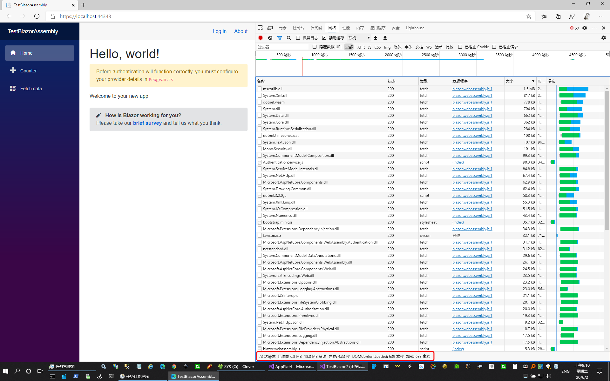
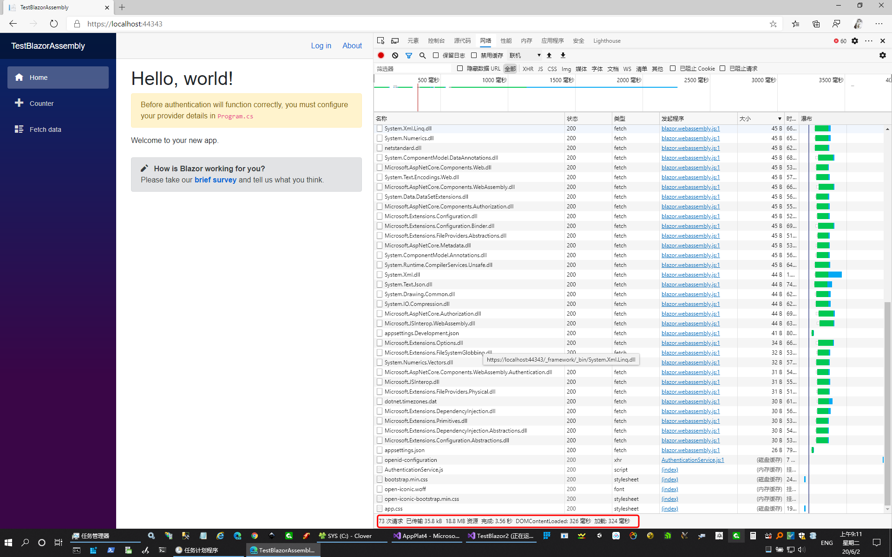

# TestBlazors

ASPNETCORE Blazor testing.

<https://github.com/surfsky/TestBlazors>

# Projects

- TestBlazor         : Blazor server side basic demo
- TestBlazorAuth     : Blazor server side & auth
- TestBlazorAssembly : Blazor assembly & auth & loading
- TestBlazorPWA.*    : Blazor PWA(server, client, shared)
- TestBlazorLib      : Blazor lib project and 3-party ui lib

# 适合场合分析

Razor Pages 
    
    作为mvc方案的替代
    它将 viewmodel 和 controller 进行了合并，更容易维护
    可用于开发 Web 前后台

Blazor server

    需要客户端和服务器端保持连接（用signalr）
    需要在服务器端为每个客户端保持页面状态，占内存。
    适合内部局域网或 Web 后台，使用的人数不会太多。
    作为公网前台应用执保留态度
    待测试：可以支撑多少用户？需要多少内存和CPU资源？

Blazor WebAssembly 

    初始传输有 18.8 M, 刷新后需要 35.8 K
    不适合开发 Web 前台，首次体验过差。
    可开发离线应用、企业内部应用
    可作为离线app框架，未来可开发为 ios、andoid 应用，考虑作为跨平台App方案。
    增加加载进度展示。参考 https://github.com/BlazorPlus/BlazorDemoWasmLoading

Blazor PWA
    
    项目分拆为3块：Server, Client(WebAssembly), Shared
    业务代码可部分共享

# More

Mobile Blazor Bindings

    使用 Blazor 语法写 Xamarin Forms 代码，替代 XAML 繁琐的绑定代码。
    https://devblogs.microsoft.com/aspnet/mobile-blazor-bindings-experiment/
    https://github.com/xamarin/MobileBlazorBindings

    

# Ref

<https://www.cnblogs.com/yilezhu/p/11031441.html>

# Snap

